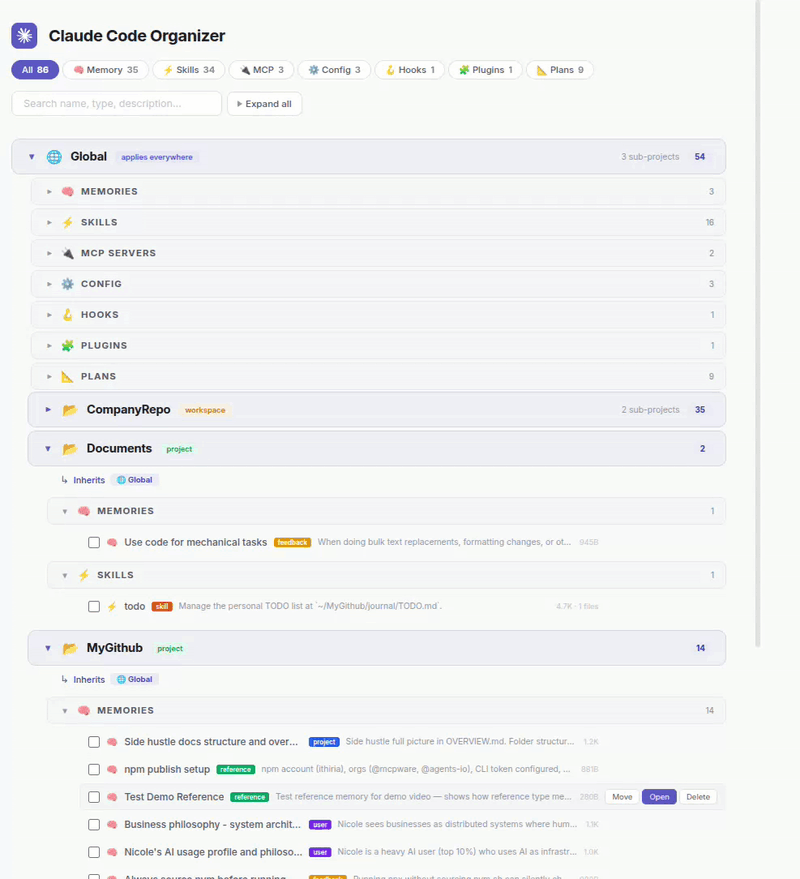

# Claude Code Organizer

[](https://www.npmjs.com/package/@mcpware/claude-code-organizer)
[](LICENSE)
[](https://nodejs.org)

[English](README.md) | [简体中文](README.zh-CN.md) | [繁體中文](README.zh-TW.md) | 日本語 | [한국어](README.ko.md)

**Claude Code のメモリ、スキル、MCPサーバー、フックをすべて管理 — スコープ階層で表示し、ドラッグ＆ドロップでスコープ間を移動。**



## 課題

Claude Code に「これを覚えて」と頼んだら、間違ったスコープに保存されていた経験はありませんか？

プロジェクトフォルダ内で Claude に設定を覚えさせると、そのプロジェクトのスコープに保存されます。別のプロジェクトに切り替えると、Claude はそれを知りません。メモリが閉じ込められてしまいます。

逆もまた然り — グローバルスコープにあるスキルやメモリが、実際には1つのリポジトリにしか適用されないのに、すべてのプロジェクトに漏れてしまいます。

修正したい場合は、`~/.claude/` とそのエンコードされたパスフォルダ（`-home-user-projects-my-app/`）を手動で探し、正しいファイルを見つけて自分で移動する必要があります。

**Claude Code Organizer がこの問題を解決します。**

### 例：プロジェクト → グローバル

プロジェクト内で Claude に「TypeScript + ESM を使いたい」と覚えさせましたが、この設定はすべてに適用されるべきです。ダッシュボードを開き、そのメモリをプロジェクトスコープからグローバルスコープにドラッグ。完了。

### 例：グローバル → プロジェクト

グローバルにデプロイスキルがありますが、1つのリポジトリにしか意味がありません。そのプロジェクトスコープにドラッグすれば、他のプロジェクトからは見えなくなります。

---

## 機能

- **スコープ階層表示** — グローバル > ワークスペース > プロジェクトで整理、継承インジケーター付き
- **ドラッグ＆ドロップ** — スコープ間でメモリ、スキル、MCPサーバーを移動
- **移動確認** — ファイルを変更する前に確認ダイアログを表示
- **同一タイプ安全性** — メモリはメモリフォルダにのみ、スキルはスキルフォルダにのみ移動可能
- **検索＆フィルター** — 全アイテムを即時検索、カテゴリ別フィルター（メモリ、スキル、MCP、設定、フック、プラグイン、プラン）
- **詳細パネル** — アイテムをクリックしてメタデータ、説明、ファイルパスを表示、VS Codeで開く
- **依存関係ゼロ** — 純粋な Node.js 組み込みモジュール、SortableJS は CDN 経由
- **実ファイル移動** — `~/.claude/` のファイルを実際に移動、単なるビューアーではありません

## クイックスタート

```bash
# 直接実行（インストール不要）
npx @mcpware/claude-code-organizer

# またはグローバルインストール
npm install -g @mcpware/claude-code-organizer
claude-code-organizer
```

または Claude Code にこれを貼り付けてください：

> `npx @mcpware/claude-code-organizer` を実行してください — Claude Code 設定を管理するダッシュボードです。準備ができたら URL を教えてください。

`http://localhost:3847` でダッシュボードが開きます。実際の `~/.claude/` ディレクトリで動作します。

## 管理対象

| タイプ | 表示 | スコープ間移動 |
|--------|:----:|:------------:|
| メモリ（フィードバック、ユーザー、プロジェクト、リファレンス） | 対応 | 対応 |
| スキル | 対応 | 対応 |
| MCPサーバー | 対応 | 対応 |
| 設定（CLAUDE.md、settings.json） | 対応 | ロック |
| フック | 対応 | ロック |
| プラグイン | 対応 | ロック |
| プラン | 対応 | ロック |

## スコープ階層

```
グローバル                      <- すべてに適用
  会社 (ワークスペース)          <- すべてのサブプロジェクトに適用
    会社リポ1                    <- プロジェクト固有
    会社リポ2                    <- プロジェクト固有
  サイドプロジェクト (プロジェクト) <- 独立プロジェクト
  ドキュメント (プロジェクト)      <- 独立プロジェクト
```

子スコープは親スコープのメモリ、スキル、MCPサーバーを継承します。

## 仕組み

1. **スキャン** `~/.claude/` — すべてのプロジェクト、メモリ、スキル、MCPサーバー、フック、プラグイン、プランを検出
2. **スコープ階層を解決** — ファイルシステムパスから親子関係を判定
3. **ダッシュボードを描画** — スコープヘッダー > カテゴリバー > アイテム行、適切なインデント
4. **移動を処理** — ドラッグまたは「移動先...」をクリックすると、安全チェック付きでディスク上のファイルを実際に移動

## プラットフォームサポート

| プラットフォーム | 状態 |
|----------------|:----:|
| Ubuntu / Linux | サポート済み |
| macOS | 動作するはず（未テスト） |
| Windows | 未対応 |
| WSL | 動作するはず（未テスト） |

## ライセンス

MIT

## 作者

[ithiria894](https://github.com/ithiria894) — Claude Code エコシステムのためのツールを構築。
